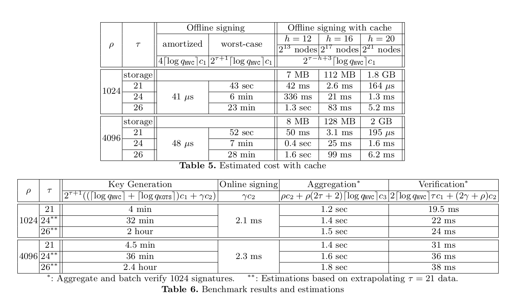

Squirrel: Efficient Synchronized Multi-Signatures from Lattices
------

This is a reference implementation for the paper: [Squirrel: Efficient Synchronized Multi-Signatures from Lattices](https://eprint.iacr.org/2022/694).

# Benchmark
```
cargo bench [--features=parallel]
```


